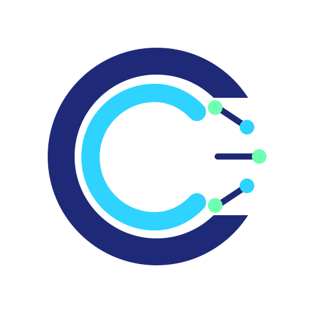

# OpenCraft CRM



OpenCraft CRM is an open-source **headless CRM engine** built as a service-oriented backend platform.
This repository currently contains the backend services, shared packages, local infra, QA tooling, and a CLI.

## Core Advantage: Spec-Driven + AI-Assisted Delivery

OpenCraft CRM is not only about architecture. A central product idea is **fast, low-friction evolution**:

- changes start from specs in `docs/superpowers/specs/`;
- implementation is executed service-by-service with AI-assisted workflows;
- QA scenarios in `tools/qa` validate behavior at CRM-flow level.

This gives teams a practical loop: **spec -> implement -> verify -> iterate**, with much higher speed and lower ambiguity.

## Why This Exists

Many teams outgrow classic SaaS CRM when process complexity increases:

- workflow logic becomes business-critical and hard to express with vendor constraints;
- integration count grows, but orchestration remains fragmented;
- ownership requirements for data, automation logic, and rollout pace become stricter.

OpenCraft CRM is built for this exact stage: keep CRM as a productized platform under your control, while staying modular and API-first.

## Product Direction

OpenCraft CRM is built around a clear product strategy:

> A headless open-source CRM Community Edition, designed for deep customization, can attract teams that value control over convenience.  
> Public code + spec-driven (AI-first) development becomes both a delivery model and a trust signal that converts into paid implementation and enterprise work.

In short: the differentiator is not just "open-source CRM", but **how quickly it can be safely adapted**.

## Platform Scope

- `20` backend services under `apps/`:
  - `12` platform services (`apps/platform/*`)
  - `8` CRM domain services (`apps/crm/*`)
- shared packages under `packages/` (event bus, logger, auth middleware, OpenAPI, etc.)
- local development stack in `docker-compose.yml` + `scripts/dev/*`
- QA scenario runner under `tools/qa`
- developer CLI under `tools/crm-cli`
- architecture and specs under `docs/`

This is a strong backend-first CRM foundation designed for teams that prioritize API control, modularity, and rapid spec-driven iteration.

## Service Map

### Platform services (`apps/platform`)

- `identity`
- `ai`
- `template`
- `notification`
- `audience`
- `analytics`
- `messaging`
- `email`
- `nurturing`
- `automation`
- `integration-hub`
- `media`

### CRM services (`apps/crm`)

- `lead`
- `pipeline`
- `conversation`
- `campaign`
- `referral`
- `reporting`
- `import`
- `api-gateway`

## Tech Stack

- Node.js `24`
- TypeScript `5` (ESM)
- Fastify `5`
- Knex `3` + PostgreSQL
- Redis (queues/cache where needed)
- Vitest (tests)
- Docker Compose (local stack)

## Who This Is For

- product/engineering teams building CRM as internal infrastructure;
- companies with non-trivial sales/ops processes and multi-system integrations;
- teams that need to control roadmap, deployment, and data boundaries.

## Repository Layout

```text
apps/              # backend services (platform + crm)
packages/          # shared libs and reusable modules
docs/              # architecture, ADRs, specs, plans
docker/            # compose configs and infra helpers
scripts/dev/       # local up/down/reset/log scripts
tools/crm-cli/     # developer CLI
tools/qa/          # scenario-based API QA runner
```

## Quick Start

### Prerequisites

- Docker Desktop (or Docker Engine + Compose plugin)
- Node.js 24

### 1) Prepare environment

```bash
cp .env.example .env
./scripts/dev/gen-keys.sh
```

### 2) Start infrastructure

```bash
./scripts/dev/up.sh
```

Starts core infra: PostgreSQL, Redis, Supabase Auth (GoTrue proxy), Mailpit.

### 3) Start all services

```bash
./scripts/dev/up-all.sh
```

### 4) Verify

```bash
curl http://localhost:3100/health
```

If this responds successfully, your local platform baseline is up and you can start iterating service-by-service.

## Local Ports (Default)

- `3100` identity
- `3101` ai
- `3102` template
- `3103` notification
- `3104` audience
- `3105` analytics
- `3106` messaging
- `3107` email
- `3108` nurturing
- `3109` automation
- `3110` integration-hub

## Develop One Service

```bash
cd apps/platform/identity
npm install
npm run migrate
npm run dev
```

## Useful Commands

```bash
./scripts/dev/logs.sh identity
./scripts/dev/down.sh
./scripts/dev/reset.sh
docker compose ps
```

## Testing & QA

- unit/integration tests: `npm test` inside a service package
- scenario QA runner: see `tools/qa/README.md`
- API exploration + debugging: see `tools/crm-cli/README.md`

The QA layer is intentionally product-oriented: scenarios are written around real CRM flows, not only isolated endpoints.

## Key Documentation

- architecture: `docs/01-platform-arch-design.md`
- doc index: `docs/NAVIGATOR.md`
- local development: `docs/development/local-dev.md`
- QA scenarios: `docs/development/testing/qa-scenarios.md`
- design specs: `docs/superpowers/specs/`

## Fast Iteration Workflow (Recommended)

1. define/adjust behavior in a spec (`docs/superpowers/specs/`);
2. implement in target service (`apps/platform/*` or `apps/crm/*`);
3. validate with tests + `tools/qa` scenarios;
4. repeat in short cycles.

This workflow is intentionally optimized for AI-assisted delivery and rapid product refinement.

## Contributing

Pull requests are welcome. Please:

1. keep PRs service-scoped;
2. update tests together with behavior changes;
3. update docs when APIs/contracts change;
4. prefer shared package reuse over service-local duplication.

If you want to propose large feature work, align first with docs in `docs/superpowers/specs/` to keep architecture and implementation in sync.

## Business & Product Context

OpenCraft CRM is developed as both:

- a reusable open-source CRM engine (Community track), and
- a base for paid implementation/customization/enterprise engagements.

This dual model is intentional: community transparency accelerates technical trust, while services monetization funds product depth.
